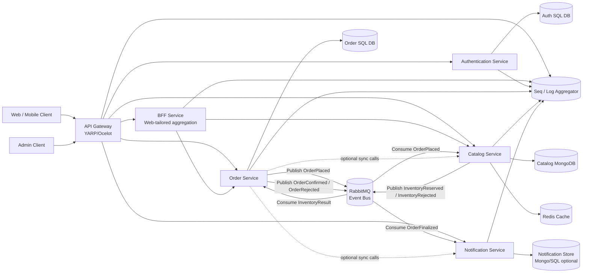

# WebApplication2 API

## Overview
WebApplication2 is an ASP.NET Core Web API project built with .NET 9.0. It provides a raffle/auction-style application backend with:
- Entity Framework Core for SQL Server data access
- JWT authentication
- Redis cache support
- Swagger / OpenAPI documentation
- Email notifications via MailKit
- AutoMapper for DTO mapping

## 🏗️ Target System Architecture


## Repository Structure
- `WebApplication2/`
  - Main ASP.NET Core project
  - `Program.cs` contains startup and dependency injection configuration
  - `Controllers/` contains API controllers
  - `DAL/` contains Entity Framework data access code and repository classes
  - `BLL/` contains business logic services
  - `Models/` contains entity and DTO models
  - `Middlewares/` contains custom middleware components
  - `Mappings/` contains AutoMapper profiles
  - `wwwroot/` contains static assets
- `docker-compose.yml` defines local development containers for API, SQL Server, and Redis
- `WebApplication2.sln` is the Visual Studio solution file for the API

## Pruned Cleanup
Removed files that were not part of the active solution or required for the API:
- Root-level helper / duplicate C# files
- Unrelated `PasswordHasher` helper project and script
- Node `package-lock.json` files
- Build output folders `WebApplication2/bin` and `WebApplication2/obj`

## Getting Started
### Prerequisites
- .NET 9 SDK
- Docker Desktop (for Docker Compose)
- SQL Server credentials configured in `docker-compose.yml`

### Run locally with Docker Compose
From the repository root:
```powershell
docker-compose up --build
```

The API will be available at `http://locFalhost:5226
`.

Gateway (Phase 3 baseline) is available at `http://localhost:5005`.

Example proxied routes through gateway:
- `http://localhost:5005/api/account/...` -> `AuthenticationService`
- `http://localhost:5005/api/order/...` -> `OrderService`
- `http://localhost:5005/api/gift/...` -> `CatalogService`
- `http://localhost:5005/api/category/...` -> `CatalogService`
- `http://localhost:5005/api/donor/...` -> `CatalogService`
- `http://localhost:5005/api/notification/...` -> `NotificationService`

The gateway propagates `x-correlation-id`. If not provided by the client, one is generated automatically.

Stage 5.3 validation runbook:
- `docs/STAGE53_CORRELATION_VALIDATION_RUNBOOK.md`

### Run from Visual Studio
1. Open `WebApplication2.sln`
2. Set `WebApplication2` as the startup project
3. Build and run

## Configuration
Key configuration values are in `WebApplication2/appsettings.json`:
- `ConnectionStrings:DefaultConnection` — SQL Server database connection string
- `Jwt:SecretKey` — symmetric JWT signing key
- `Redis:Connection` — Redis endpoint
- `EmailSettings` — SMTP server and sender settings

## Development Notes
- Swagger UI is enabled by default and is available at `/swagger`
- The project automatically applies pending EF Core migrations at startup
- `WebApplication2/DAL/StoreContext.cs` is the active database context used by the app
- RabbitMQ is implemented as an event bus for the Order, Catalog, and Notification services
- The main event flow is `order.placed` -> `inventory.reserved` / `inventory.rejected` -> `order.status-changed`

## Final Project Status
- Implemented: API Gateway, BFF, RabbitMQ-based saga choreography, Redis, and structured logging/health checks across the split services.
- Partially covered: database-per-service and polyglot persistence are present, but the documentation and ADR set still need to be completed for the course rubric.
- Not covered yet: the Phase 1 monolith baseline, a documented load-balancing proof for 2+ replicas, a written RabbitMQ comparison if required, demo evidence screenshots/logs, and CI/CD pipeline bonus deliverables.
- Tech note: the repo currently targets .NET 9 in places, while the assignment explicitly asks for a .NET 8 monolith baseline.
- RabbitMQ decision record: [docs/adr/ADR-2026-07-07-RabbitMQ-EventBus.md](docs/adr/ADR-2026-07-07-RabbitMQ-EventBus.md)

## Recommended Next Steps
- Secure `Jwt:SecretKey` and email credentials outside source control
- Add unit and integration tests for controllers and services
- Remove hard-coded development values from production deployment
- Add a proper documentation folder for future architecture notes
