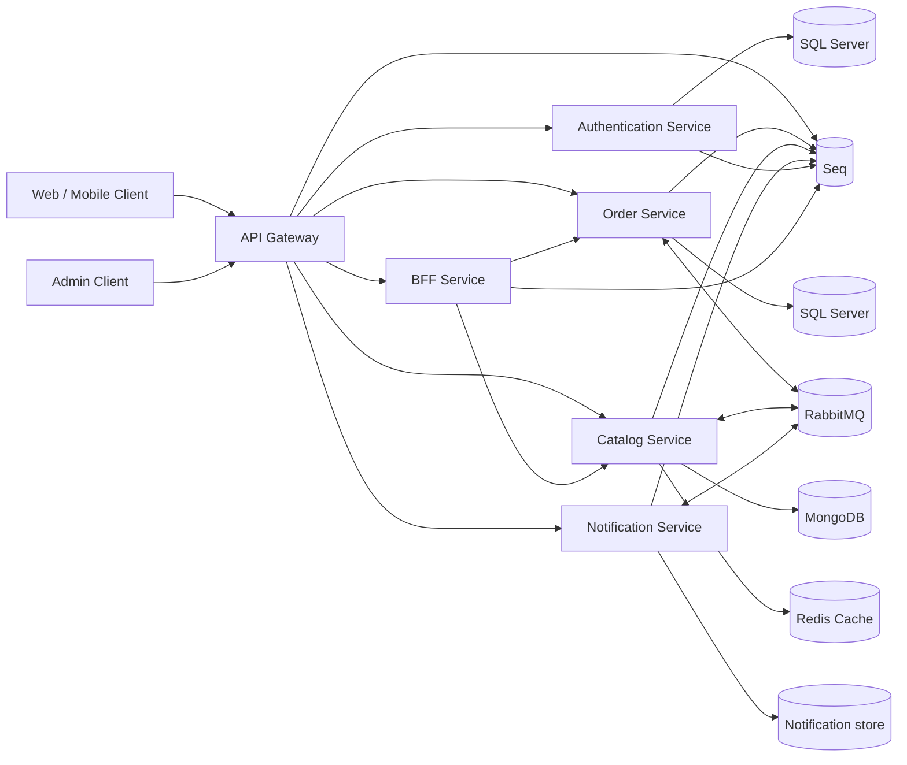

# Final Project Architecture Document

## 1. Purpose

This repository implements the final project as a distributed e-commerce order system. The goal is to show a realistic progression from a monolithic application to a production-style microservice architecture with clear service boundaries, polyglot persistence, asynchronous messaging, a saga workflow, a gateway, a BFF, caching, and observability.

The system is centered around a single business flow: a customer places an order, inventory is checked, the order is either confirmed or compensated, and the customer receives a final notification.

## 2. Final System View

The README contains the same high-level architecture diagram, but this document explains the decisions behind it.

## 3. Service Boundaries

The system is split into four main business services plus edge components:

- Authentication Service: authentication and JWT issuance.
- Order Service: order creation, order state transitions, and saga coordination.
- Catalog Service: gifts/products, categories, donors, and inventory-related reads.
- Notification Service: customer notifications and notification history.
- API Gateway: single entry point for clients.
- BFF Service: client-specific aggregation for the web application.

Each service owns its own data and business rules. No service reaches into another service's database or repository layer.

## 4. Data Ownership and Persistence

The project uses database-per-service and polyglot persistence:

- Order Service uses SQL Server because order state is transactional and must remain ACID.
- Catalog Service uses MongoDB because catalog documents vary by type and category.
- Notification Service uses a small persistence layer for history and delivery state.
- Redis is used for fast cache and low-latency inventory-related reads.

This design follows the course requirement to keep each service autonomous and to choose storage according to the access pattern of the bounded context.

### ADR references

- [Authentication relational ADR](adr/ADR-2026-07-05-AuthenticationService-Relational.md)
- [Order relational ADR](adr/ADR-2026-07-05-OrderService-Relational.md)
- [Catalog document database ADR](adr/ADR-2026-07-05-ProductCatalog-DocumentDB.md)
- [Inventory key-value ADR](adr/ADR-2026-07-05-Inventory-KeyValue.md)
- [Notification event log ADR](adr/ADR-2026-07-05-Notification-EventLog.md)
- [RabbitMQ event bus ADR](adr/ADR-2026-07-07-RabbitMQ-EventBus.md)

## 5. Messaging and Saga

RabbitMQ is the asynchronous backbone of the order saga.

Event flow:

1. Order Service publishes `order.placed`.
2. Catalog Service consumes the event and checks whether the ordered items can be reserved.
3. Catalog Service publishes either `inventory.reserved` or `inventory.rejected`.
4. Order Service consumes the inventory result.
5. On success, Order Service confirms the order.
6. On failure, Order Service cancels the order and publishes `inventory.release-requested` as compensation.
7. Notification Service consumes `order.status-changed` and informs the customer.

The RabbitMQ design uses topic routing, durable queues, dead-letter queues, and retry headers. This keeps the implementation understandable while still demonstrating an at-least-once, production-style message flow.

### Why RabbitMQ

RabbitMQ was selected over Kafka for this project because the system needs saga choreography rather than a high-volume streaming platform. RabbitMQ is easier to run locally, simpler to explain in a presentation, and sufficient for topic-based message routing and compensation.

Kafka would be a strong option for replay-heavy pipelines and large event history, but it would add extra operational and conceptual overhead without improving the project outcome.

## 6. Gateway and BFF

The API Gateway is the only public entry point. It centralizes routing and correlation propagation.

The BFF is responsible for client-shaped responses. It aggregates data from at least two services and returns a response optimized for the web client rather than exposing raw service contracts.

This separation keeps cross-cutting concerns in the gateway and presentation-oriented composition in the BFF.

## 7. Caching and Read Performance

Catalog reads use Redis cache-aside. The first read is a cache miss and loads the data from the source of truth; later reads hit Redis. Product updates should invalidate or refresh the relevant keys so that the cache does not serve stale catalog data.

This choice matches the project requirement to demonstrate a distributed cache and to explain a practical invalidation strategy.

## 8. Observability and Correlation

Every service uses structured logging and exposes `/health`. The root `docker-compose.yml` wires health checks for the running containers.

Correlation IDs are propagated from the gateway to the downstream services and across the message broker. The same ID appears in logs and message metadata so a single order can be traced through the full saga.

Example traced saga with one correlation ID:

- Client sends `POST /orders/api/order/checkout` through the gateway with header `x-correlation-id: saga-order-1001`.
- ApiGateway keeps `saga-order-1001` on the request, sets it as the response header, and pushes `CorrelationId=saga-order-1001` into structured logs.
- OrderService persists the order, publishes `order.placed`, and the RabbitMQ message metadata carries `CorrelationId=saga-order-1001` and header `x-correlation-id=saga-order-1001`.
- CatalogService consumes `order.placed`, logs `Received OrderPlaced for OrderId=1001 CorrelationId=saga-order-1001`, evaluates inventory, and publishes either `inventory.reserved` or `inventory.rejected` with the same correlation ID in broker metadata.
- OrderService consumes the inventory result, logs `Received inventory result for OrderId=1001 Success=True CorrelationId=saga-order-1001`, updates order state, and publishes `order.status-changed` with the same correlation ID.
- NotificationService consumes `order.status-changed` and logs `Handling order.status-changed for OrderId=1001 Status=Confirmed CorrelationId=saga-order-1001`.
- In Seq, filtering by `CorrelationId = 'saga-order-1001'` shows the same request flowing through gateway, OrderService, CatalogService, and NotificationService with the same ID across HTTP and RabbitMQ hops.

## 9. Consistency Model and Tradeoffs

The final architecture is not strongly consistent across services. Instead, it relies on:

- ACID only where it matters most, such as order persistence.
- Eventual consistency across the saga.
- Idempotent consumers.
- Compensation for failures.

This is an intentional tradeoff. The system is designed to be explainable, testable, and realistic for a course project, not to emulate a single distributed transaction.

## 10. Current Gaps Relative to the Full Rubric

The codebase already demonstrates the major architecture pieces, but the submission package still needs full project evidence and some deliverables to satisfy the rubric completely:

- Phase 1 monolith baseline documentation if required by the course review.
- Load-balancing proof for a replicated service.
- Demo evidence for happy path, compensation path, cache hit/miss, and correlation tracing.
- Optional CI/CD bonus pipeline, if you want the extra points.

## 11. Conclusion

This project shows a complete microservice-style order flow with RabbitMQ-based saga choreography, service-owned data, caching, gateway/BFF layering, and observability. The architectural choices prioritize clarity and local reproducibility while still matching the core ideas of production distributed systems.

## תרגום לעברית

מסמך זה מתאר מערכת הזמנות מבוזרת שנבנתה מתוך מונולית והפכה לארכיטקטורת מיקרו-שירותים עם חלוקת אחריות ברורה.

המערכת כוללת:

- API Gateway כשער כניסה יחיד ללקוחות.
- BFF שמאגד נתונים משני שירותים לפחות.
- Order Service שמנהל יצירת הזמנות, שינויי מצב ותיאום ה-saga.
- Catalog Service שמנהל מוצרים/מתנות, קטגוריות ונתוני מלאי.
- Notification Service שמעדכן את הלקוח על תוצאה סופית של ההזמנה.

התקשורת האסינכרונית מתבצעת באמצעות RabbitMQ:

1. Order Service מפרסם `order.placed`.
2. Catalog Service צורך את ההודעה ובודק אם ניתן לשמור את המלאי.
3. Catalog Service מפרסם `inventory.reserved` או `inventory.rejected`.
4. Order Service מעדכן את ההזמנה בהתאם לתוצאה.
5. במקרה כשל, Order Service מבצע compensation ומפרסם `inventory.release-requested`.
6. Notification Service שולח הודעה ללקוח על המצב הסופי.

הנתונים מפוצלים לפי שירות:

- Order Service משתמש ב-SQL Server כי הזמנות דורשות ACID.
- Catalog Service משתמש ב-MongoDB כי מבנה הקטלוג גמיש ומשתנה לפי סוג פריט.
- Notification Service שומר נתוני התראות והיסטוריה.
- Redis משמש כ-cache מהיר לנתוני קריאה.

המערכת מתוכננת עם logging מובנה, endpoint-ים של health, ו-Correlation ID שעובר בין השירותים וגם דרך הברוקר, כדי שניתן יהיה לעקוב אחרי הזמנה אחת מקצה לקצה.

הבחירה ב-RabbitMQ נעשתה כי היא מתאימה במיוחד ל-saga choreography בפרויקט הזה: קלה להרצה מקומית, פשוטה להסבר, ותומכת ב-topic routing, retries ו-dead-letter queues.